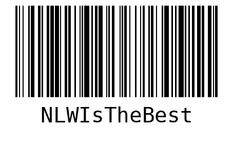

# GERADOR DE CÓDIGOS DE BARRA COM PYTHON

Construído durante o evento __NLW Expert__ da @Rocketseat 

__Durante os três dias de evento foram realizados:__
- Desenvolvimento de uma aplicação back-end em Python, utilizando Flask como framework. 
- Preparação de ambiente e boas práticas de projeto com Virtualenv, Pylint e versionamento de código usando pre-commit.
- Criação de código de barras com python-barcode e testes com Pytest.

